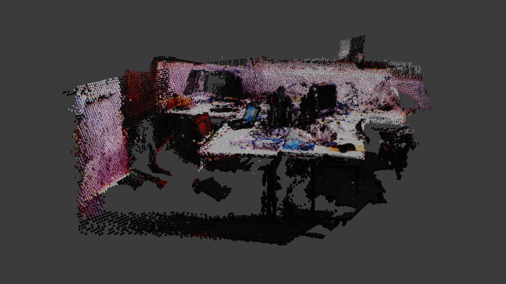
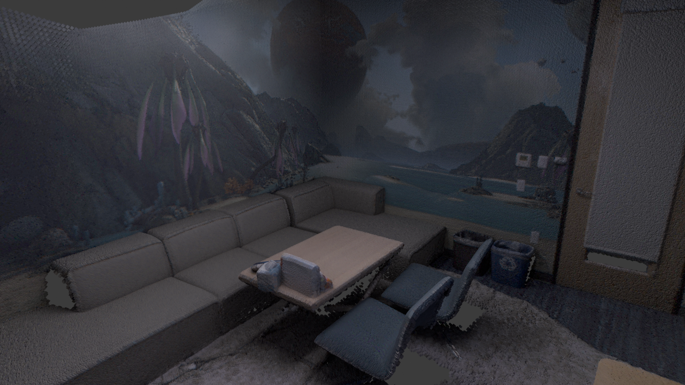
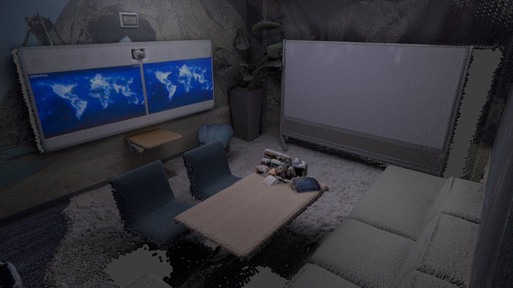
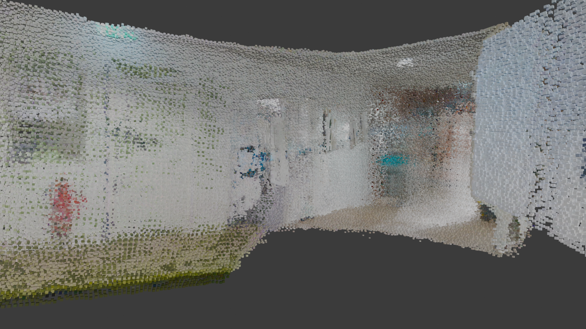
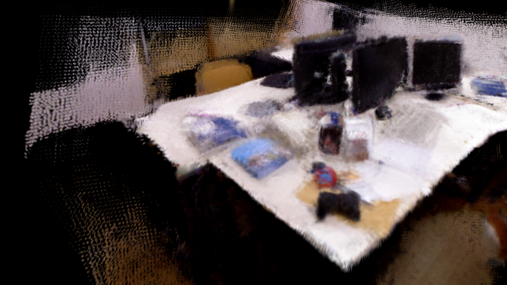
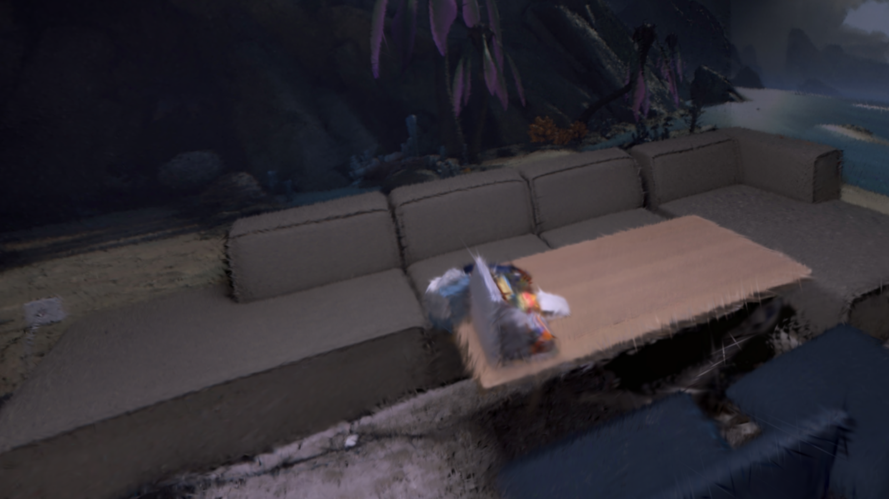

# Visualisierung der GS_ICP_SLAM Ergebnisse

## PLY-Converter

Die PLY Files, die der GS_ICP_SLAM ausgibt, sind nicht mit den Gaussing/PLY Plugins von Blender und Unity kompatibel und müssen daher angepasst werden. Das Format der GS_ICP_SLAM PLY Files muss in ein gültiges Format konvertiert werden. Dazu haben wir den [PLY-Converter](./ply_converter.py) geschrieben. Dieser wandelt die GS_ICP_SLAM PLY Files in ein gültiges Format für Blender oder Unity um.

### GS_ICP_SLAM PLY Format

Der GS_ICP_SLAM gibt als Output die PLY Files in folgendem Format aus:

```
ply
format binary_little_endian 1.0
element vertex 1719756
property float x
property float y
property float z
property float nx
property float ny
property float nz
property float f_dc_0
property float f_dc_1
property float f_dc_2
property float opacity
property float scale_0
property float scale_1
property float scale_2
property float rot_0
property float rot_1
property float rot_2
property float rot_3
end_header
```

### Blender PLY Format

Das [Import-PLY-As-Verts](https://github.com/TombstoneTumbleweedArt/import-ply-as-verts) Addon in Blender, mit dem wir PLY Files in Blender importieren können, erwartet folgendes PLY Format:

```
ply
format binary_little_endian 1.0
element vertex 1719756
property float x
property float y
property float z
property uchar red
property uchar green
property uchar blue
property float nx
property float ny
property float nz
end_header
```

Mit dem [PLY-Converter](./ply_converter.py) wird der Header entsprechend angepasst und die Farbwerte der einzelnen Vertices auf einen Bereich von 0 bis 255 umgerechnet und in uchar-Werte umgewandelt.

Die Parameter ```f_dc_0```, ```f_dc_1```, ```f_dc_2``` stehen für die Farbe der Vertices. Allerdings sind die Werte der Parameter keine RGB-Werte im Bereich von 0 bis 255 und müssen daher umgerechnet werden, denn das Import-PLY-As-Verts Addon erwartet als Farbwerte für die Vertices RGB-Werte im Bereich von 0 bis 255.

Der erste Ansatz war, davon auszugehen, dass die Werte der ```f_dc_0```, ```f_dc_1```, ```f_dc_2``` Parameter im Bereich von 0 bis 1 liegen. Anschließend wurden die Werte dann in den RGB-Bereich von 0 bis 255 umgerechnet. Dieser Ansatz führte allerdings zu keinem richtigen Ergebnis, da die Vertices nicht die korrekten Farbwerte bekommen haben.

Nach längerem Recherchieren sind wir auf [diesen](https://github.com/graphdeco-inria/gaussian-splatting/issues/485) Github Issue gestoßen, in dem genau diese Umrechnung thematisiert wird. Die RGB-Werte der Parameter ```f_dc_0```, ```f_dc_1```, ```f_dc_2``` müssen mit der folgenden Formel berechnet werden:

$R = 0.5 + C0 * f_dc_0$

$G = 0.5 + C0 * f_dc_1$

$B = 0.5 + C0 * f_dc_2$

$C0 = 0.28209479177387814$ (sphärischer harmonischer Koeffizient nullter Ordnung)

Mit dieser Formel erhält man für die Farbwerte Werte im Bereich von 0 bis 1 und kann diese in RGB-Werte im Bereich von 0 bis 255 umrechnen.
Der Abschnitt [Wrong vs correct Color Conversion](#wrong-vs-correct-color-conversion) zeigt die falsch berechneten Farbwerte der Vertices, sowie die korrekt berechneten Farbwerte.

### Unity PLY Format

Das [UnityGaussianSplatting](https://github.com/aras-p/UnityGaussianSplatting) Package in Unity, mit dem Gaussians in Unity gerendert werden können, erwartet folgendes PLY Format:

```
ply
format binary_little_endian 1.0
element vertex 1719756
property float x
property float y
property float z
property float nx
property float ny
property float nz
property float f_dc_0
property float f_dc_1
property float f_dc_2
property float f_rest_0
...
property float f_rest_44
property float opacity
property float scale_0
property float scale_1
property float scale_2
property float rot_0
property float rot_1
property float rot_2
property float rot_3
end_header
```

Das Package erwartet f_rest properties von 0 bis 45 für jeden Vertex. Der [PLY-Converter](./ply_converter.py) passt den Header entsprechend an und fügt bei allen Vertices die 45 f_rest properties mit dem initialen Wert 0.0 hinzu.

## Blender

### Setup

Software:
- Blender 4.1.1

Addons:
- [Import-PLY-As-Verts](https://github.com/TombstoneTumbleweedArt/import-ply-as-verts)

### Vorgehen

1. Importieren von PLY Files in Blender
   - Zunächst musste ein Weg gefunden werden, PLY Files in Blender zu importieren --> [Import-PLY-As-Verts](https://github.com/TombstoneTumbleweedArt/import-ply-as-verts) Addon.
   - Die GS_ICP_SLAM PLY haben mit dem Addon nicht funktioniert, da das Addon ein anderes PLY Format erwartet.
   - Mit dem [PLY-Converter](#ply-converter) werden die PLY Files nun in das erwartete Format konvertiert und können in Blender importiert werden.
   - Die Gaussians werden in Blender als Vertices importiert/repräsentiert.
2. Rendern von Gaussians/Vertices

   Die Vertices können mit zwei verschieden Methoden gerendert werden:

   **Render as Point Cloud**

    - Vertices werden als Points gerendert.
    - Farbe der Points werden durch die Farbattribute der jeweiligen Vertices festgelegt.
    - Diese Methode ist effizienter, da keine wirkliche Geometrie/Mesh erzeugt wird. Allerdings kann so die Punktwolke nicht im Viewport gerendert werden.

   **Instancing**

   - Vertices werden als Mesh gerendert.
   - Für jeden Vertex ein Cube(Würfel) instanziiert.
   - Farbe der Cubes werden durch die Farbattribute der jeweiligen Vertices festgelegt.
   - Diese Methode ist rechenintensiver, allerdings können die Vertices/Cubes auch im Viewport gerendert werden.

3. Rendern der GS_ICP_SLAM Ergebnisse
   - Zunächst wurde für das TUM Datenset das Ergebnis des GS_ICP_SLAM in Blender mit beiden Methoden gerendert
   - Anschließend wurden die Ergebnisse des GS_ICP_SLAM für das Replica und die Custom Datensets mit der Instancing Methode gerendert

### Ergebnisse

#### TUM Dataset

Figure 1: Blender-Instancing-TUM


Figure 2: Blender-PointCloud-TUM


#### Point Cloud Rendering vs Instancing

GIF 1: Blender-Instancing-TUM


GIF 2: Blender-PointCloud-TUM


#### Wrong vs correct Color Conversion

Figure 3: Blender-Instancing-TUM-Wrong Color


Figure 4: Blender-Instancing-TUM-Correct Color


#### Replica Dataset

Figure 5: Blender-Instancing-REPLICA-1


Figure 6: Blender-Instancing-REPLICA-2


#### Custom Dataset

Figure 7: Blender-Instancing-CUSTOM-Gang1


Figure 8: Blender-Instancing-CUSTOM-Gang2-1


Figure 9: Blender-Instancing-CUSTOM-Gang2-2


Figure 10: Blender-Instancing-CUSTOM-Gang3


## Unity VR

### Setup

Software:
- Unity Editor 2022.3.7f1 (Built-in Render Pipeline)
- Meta Quest Link

Packages:
- [UnityGaussianSplatting](https://github.com/aras-p/UnityGaussianSplatting)

Hardware:
- Meta Quest 3

### Vorgehen

1. UnityGaussianSplatting Package testen
   - Beispiel Unity Projekt des Github Repos getestet.
   - Import der GS_ICP_SLAM PLY Files hat nicht funktioniert, da das Package ein anderes PLY Format erwartet --> [PLY-Converter](#ply-converter)
   - Mit dem [PLY-Converter](#ply-converter) konnten die GS_ICP_SLAM Ergebnisse dann erfolgreich in Unity dargestellt/gerendert werden.
   - Beispiel Projekt ist nicht VR! --> UnityGaussianSplatting Package mit VR kombinieren.
2. Unity VR Template (URP)
   - Zunächst haben wir in einer aktuellen Unity Editor Version ein Unity VR Projekt mit dem VR Core Template zu erstellt.
   - Anschließend wurde das UnityGaussianSplatting Package in das Projekt importiert.
   - Diverse Fehler/Errors: Gaussians werden weder im Editor noch im Game View gerendert.
3. Unity URP Projekt (Standalone apk build)
   - Da das Package mit dem Unity VR Template nicht funktioniert hat, haben wir ein Standard Unity URP Projekt in der Editor Version des Beispielprojekts erstellt.
   - Anschließend wurde das UnityGaussianSplatting Package in das Projekt importiert --> die Gaussians wurden im Editor und Game View korrekt und ohne Probleme gerendert.
   - Nun musste das Projekt für VR vorbereitet werden, um die Gaussians in VR sehen zu können.
   - Dafür wurden die notwendigen XR Packages von Unity importiert und das Projekt entsprechend eingestellt.
   - Anschließend wurde ein VR/XR Character Controller erstellt, der notwendig ist, um das Projekt in VR erleben zu können.
   - Um das Projekt zu testen, wurde versucht eine Standalone apk zu bauen und auf die Meta Quest 3 zu laden --> ohne Erfolg: Build war nicht erfolgreich (190 Build Fehler)
   - Nach langer Recherche und Nachdenken zu der Erkenntnis gelangt, dass das UnityGaussianSplatting Package nicht darauf ausgelegt ist als standalone apk build auf der Meta Quest 3 direkt zu laufen --> als Windows build erstellen und über ein Kabel auf die Quest 3 streamen.
4. Unity URP Projekt (Windows build / wired to computer setup)
   - Das Projekt wurde von Android auf Windows umgestellt und angepasst.
   - Mit der Meta Quest Link App auf Windows kann die Quest 3 mit dem Computer verbunden werden und der Computer kann auf die Brille gestreamt/übertragen werden.
   - Der Unity Editor Playmode kann zum Testen direkt auf die Brille gestreamt werden und es ist kein vorherigen Builden der Anwendung notwendig.
   - Die Gaussians werden auf der Brille nicht korrekt gerendert. Sie sind doppelt zu sehen auf beiden Linsen der Brille. Zudem verändert sich die Position der Gaussians mit der Blickrichtung der Brille.
   - Nach langem Testen, Einstellen und Recherchieren sind wir zu der Erkenntnis gelangt, dass die Universal Render Pipeline (URP) von Unity Probleme hat die Gaussians korrekt zu rendern. --> Wechsel zur Built-in Render Pipeline von Unity
5. Unity Built-in Render Pipeline Projekt
   - Es wurde ein komplett neues Unity Projekt mit der Built-in Render Pipeline erstellt.
   - Erneutes Installieren des UnityGaussianSplatting Package, Vorbereiten des Projekts auf VR, ...
   - Nun werden die Gaussians in VR korrekt gerendert

### Ergebnisse

#### TUM Dataset

Figure 11: UnityVR-TUM-1


Figure 12: UnityVR-TUM-2


Figure 12: UnityVR-TUM-3


#### Replica Dataset

Figure 13: UnityVR-REPLICA-1


Figure 14: UnityVR-REPLICA-2


Figure 15: UnityVR-REPLICA-3


Figure 16: UnityVR-REPLICA-4


#### Custom Dataset

Figure 17: UnityVR-CUSTOM-Gang1


Figure 18: UnityVR-CUSTOM-Gang2


Figure 19: UnityVR-CUSTOM-Gang3


## Setup Unity Project

Um das Unity Projekt selbst aufzusetzen und zu starten, folge dem [Unity Setup Guide](./unity_setup_guide.md).

## PLY Files

Die PLY Files sind teilsweise zu groß, um sie in diesem Repo hochladen zu können. Daher können die PLY Files über diesen [Link](https://workupload.com/file/QVCBJSXqTkq) heruntergeladen werden (Verfügbar bis Ende Oktober 2024, danach wieder auf Anfrage).

## Blender File

Da auch die Blender File durch die importierten PLY Files zu groß ist, um sie in diesem Repo hochladen zu können, kann sie über diesen [Link](https://workupload.com/file/eVksNyxJLpE) heruntergeladen werden (Verfügbar bis Ende Oktober 2024, danach wieder auf Anfrage)