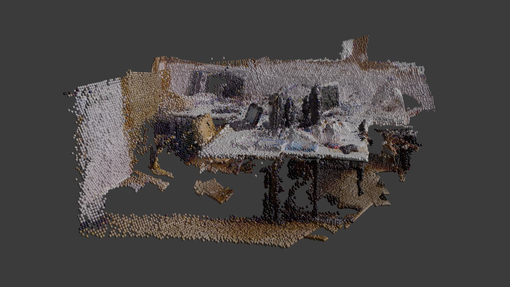
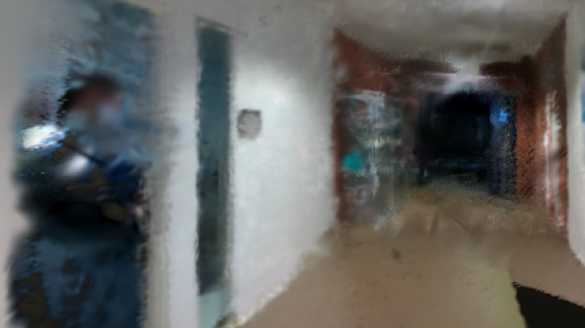
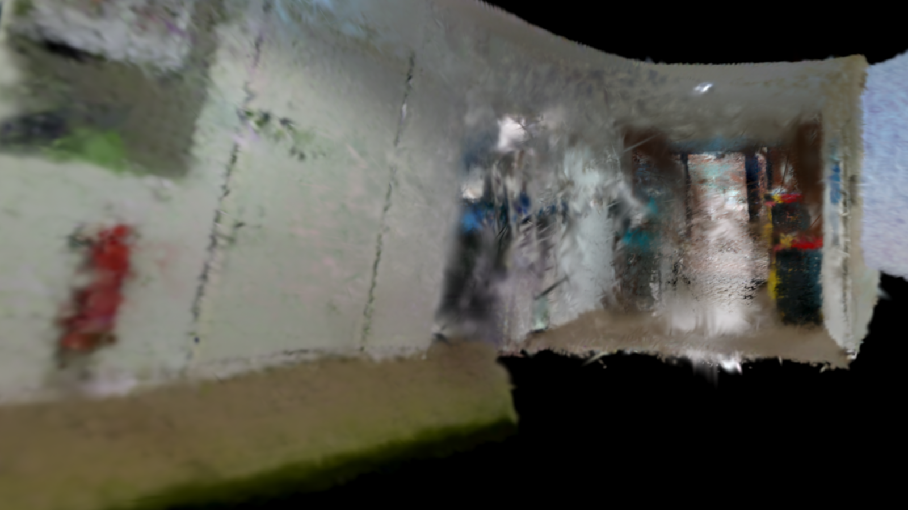

#### TUM Dataset

Figure 1: Blender-Instancing-TUM  

Figure 2: Blender-PointCloud-TUM

#### Point Cloud Rendering vs Instancing

GIF 1: Blender-Instancing-TUM  

GIF 2: Blender-PointCloud-TUM

#### Wrong vs correct Color Conversion

Figure 3: Blender-Instancing-TUM-Wrong Color  

Figure 4: Blender-Instancing-TUM-Correct Color

#### Replica Dataset

Figure 5: Blender-Instancing-REPLICA-1  

Figure 6: Blender-Instancing-REPLICA-2

#### Custom Dataset

Figure 7: Blender-Instancing-CUSTOM-Gang1  

Figure 8: Blender-Instancing-CUSTOM-Gang2-1  

Figure 9: Blender-Instancing-CUSTOM-Gang2-2  

Figure 10: Blender-Instancing-CUSTOM-Gang3

## Unity VR

### Setup

Software:
- Unity Editor 2022.3.7f1 (Built-in Render Pipeline)
- Meta Quest Link

Packages:
- [UnityGaussianSplatting](https://github.com/aras-p/UnityGaussianSplatting)

Hardware:
- Meta Quest 3

### Results

#### TUM Dataset

Figure 11: UnityVR-TUM-1  

Figure 12: UnityVR-TUM-2  

Figure 12: UnityVR-TUM-3

#### Replica Dataset

Figure 13: UnityVR-REPLICA-1  

Figure 14: UnityVR-REPLICA-2  

Figure 15: UnityVR-REPLICA-3  

Figure 16: UnityVR-REPLICA-4

#### Custom Dataset

Figure 17: UnityVR-CUSTOM-Gang1  

Figure 18: UnityVR-CUSTOM-Gang2  

Figure 19: UnityVR-CUSTOM-Gang3