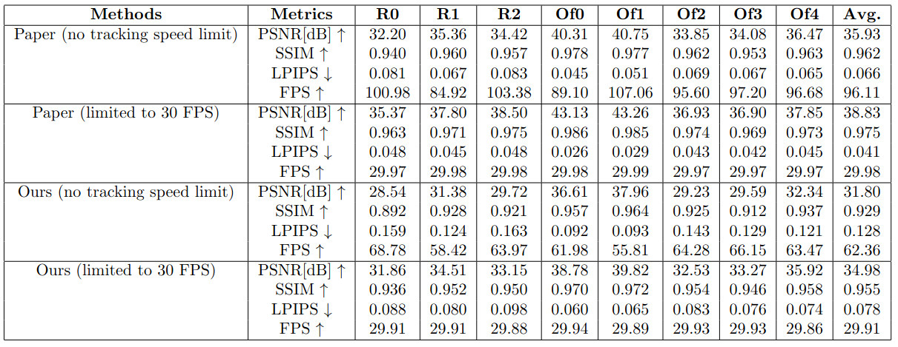
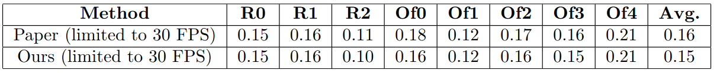
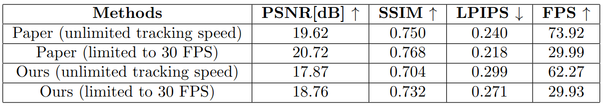
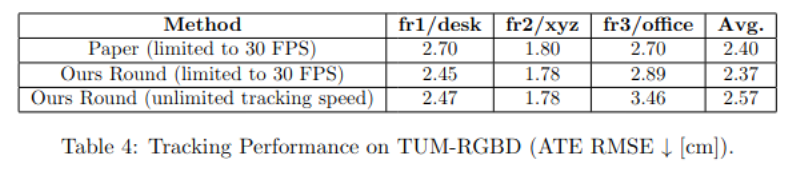

# Projektbeschreibung

## Aufteilung der Aufgaben 
- Algorithmus (Nico, Leon, Johanna)
    - Algorithmus aufsetzen (Nico)
    - eigenen Datensatz erstellen (Leon & Johanna)
    - Algorithmus anpassen für eigenen Datensatz (Nico, Leon & Johanna)
- Blender/Unity (Tim, Alex)

## Vorgehen

### Algorithmus
Um eigene Datensätze für den Algorithmus zu verwenden, musste dieser angepasst werden. Das Vorgehen dazu ist in der [Algorithmus-Doku](algorithm_changes_doc.md) beschrieben.

### Visualisierung
Um die Gaussians des GS_ICP_SLAM besser darzustellen, bzw. diese greifbar und vorstellbar zu machen, haben wir die Gaussians in Blender und Unity(VR) gerendert. Die Ergebnisse werden in der [Visualisierungs-Doku](3D_Visualization/3d_visualization_docs.md) erläutert.

## Experimente
### Hardware
    12th Gen Intel(R) Core(TM) i9-12900 CPU
    128GB RAM
    NVIDIA RTX A2000
    12GB GPU Memory
### Evaluation 

Table 1: Evaluation of System Speed and Map Quality on Replica.

Table 2: Tracking Performance on Replica (ATE RMSE ↓ [cm]).

Table 3: Evaluation of System Speed and Map Quality on TUM-RGBD.

Table 4: Tracking Performance on TUM-RGBD (ATE RMSE ↓ [cm]). It seems that the results for the ATE RMSE for TUM are basically random.
